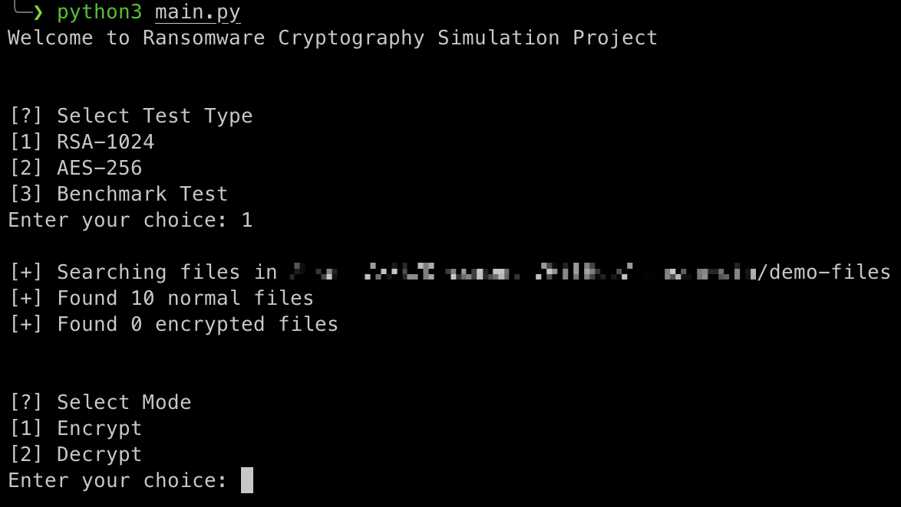
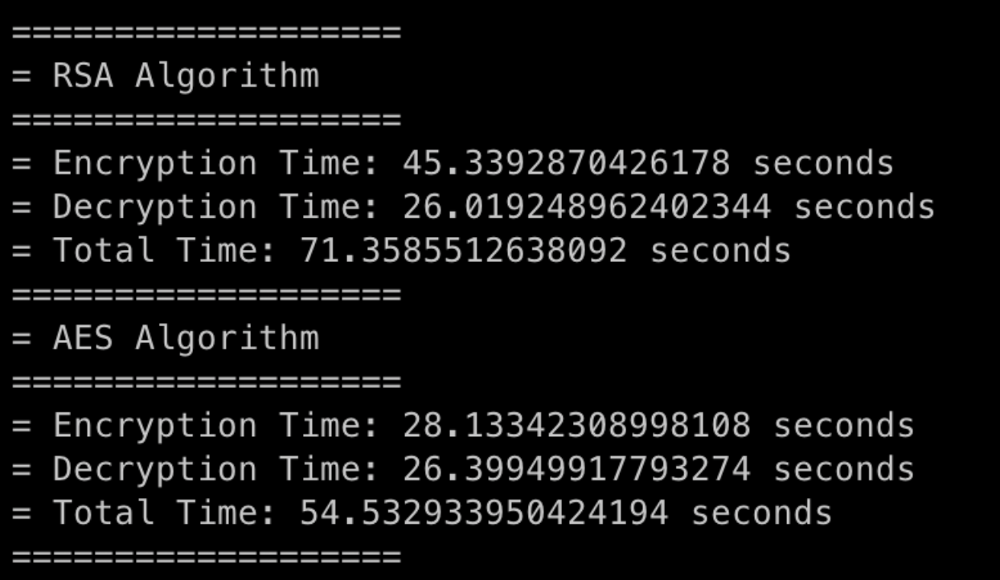
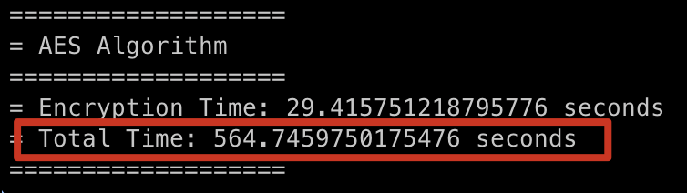

# Ransomware Encryption Simulation

```
This tool was written for speed comparison of encryption algorithms in file encryption. It is used for educational purposes and non-educational use is not recommended.

Please do not infect companies with ransomware :') thx
```

## Usage



## Test Results

### ~5.7GB Files RSA & AES Benchmark Test



### ~100GB Files AES Benchmark Test

`~5.7GB x 20 = ~100GB`

